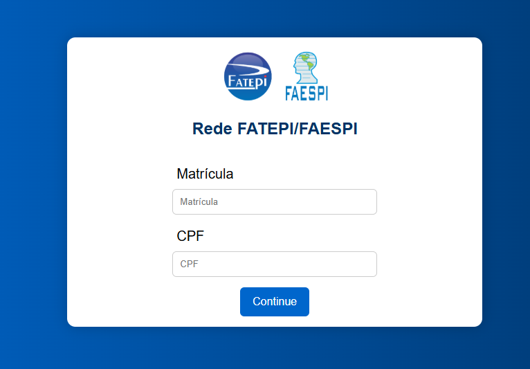

# 📶 Wi-Fi Authentication Portal

Login interface with user authentication for accessing an institutional Wi-Fi network, using academic credentials.

## 📸 Project Preview

## 🛠️ Technologies

- HTML
- CSS (inline)

## ⚙️ Features

- User login interface
- Credential-based authentication simulation
- Clean and simple layout

## 🎯 Project Goal

Develop a login interface with basic authentication, following specific requirements such as using inline CSS within the HTML file.

## 📚 Context

Academic project created to simulate an authentication system for accessing a Wi-Fi network in an educational institution.

## 🚀 How to Use

1. Enter your institutional credentials  
2. Click the login button  
3. The system simulates Wi-Fi network access  

## 👨‍💻 Author

Luis Francisco