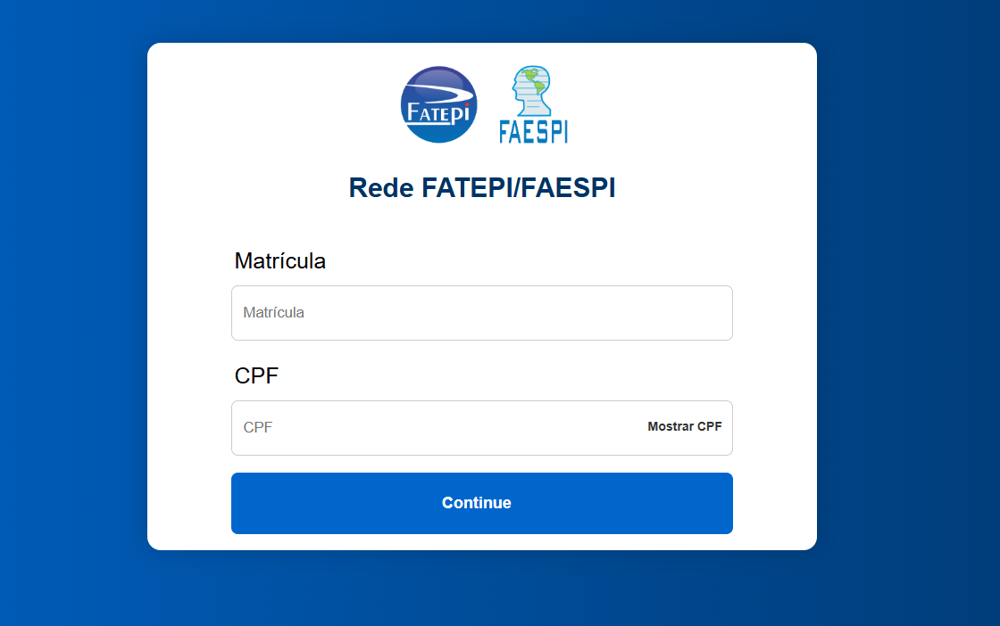

# 📶 Institutional Wi-Fi Access Redesign

Modernized login interface with user authentication and dynamic interactions for accessing the FATEPI/FAESPI institutional Wi-Fi network.

## 📸 Project Preview & Evolution

Showcasing the visual and functional evolution of the login interface:

<p align="center">
  
  
</p>

---

## 🛠️ Technologies

- HTML5
- CSS3 (External stylesheet & native `@keyframes` animations)
- JavaScript (ES6+ DOM Manipulation)

---

## ⚙️ Features

- **Responsive & Clean Layout:** Modern, centered interface fully adapted for mobile devices (Mobile-First).
- **Password Visibility Toggle:** A button that changes from "Mostrar CPF" to "Esconder CPF" dynamically, helping users avoid typos.
- **Button Micro-interactions:** Smooth physical feedback using 3D transitions on hover (`translateY`) and click (`scale`).
- **Loading Spinner Simulation:** Displays a 2-second spinning animation before submitting, disabling the submit button to prevent double-clicks.
- **Form Validation:** Basic checks preventing the user from submitting empty fields.

---

## 🎯 Project Goal

Modernize the login portal using best practices of UX/UI, splitting the code into dedicated HTML, CSS, and JS files, while adding seamless feedback and interactive states.

---

## 📚 Context

Academic project developed for the **Decision Tools** course under **Professor Shalton Viana**, simulating a secure authentication diagnosis and portal access for the FATEPI/FAESPI network.

---

## 🚀 How to Use

1. Enter your academic credentials (Matrícula & CPF).
2. Use the "Mostrar CPF" button to double-check your input if needed.
3. Click the **Continue** button.
4. Watch the loading spinner trigger for 2 seconds.
5. The system will alert you and simulate the successful redirect.

---

## 📦 How to Run the Project Locally

### 1. Clone this repository:

```bash
git clone https://github.com/luisfrancisco2b/wifi-authentication-portal
```

### 2. Navigate to the project folder

```bash
cd wifi-authentication-portal
```

### 3. 🚀 Running the Project

```bash
Since this is a front-end application, you can run it directly.

Open the `index.html` file in your browser, or run it using an extension like **Live Server** in VS Code:

http://127.0.0.1:5500/index.html
```

---

## 👨‍💻 Author

Luis Francisco
